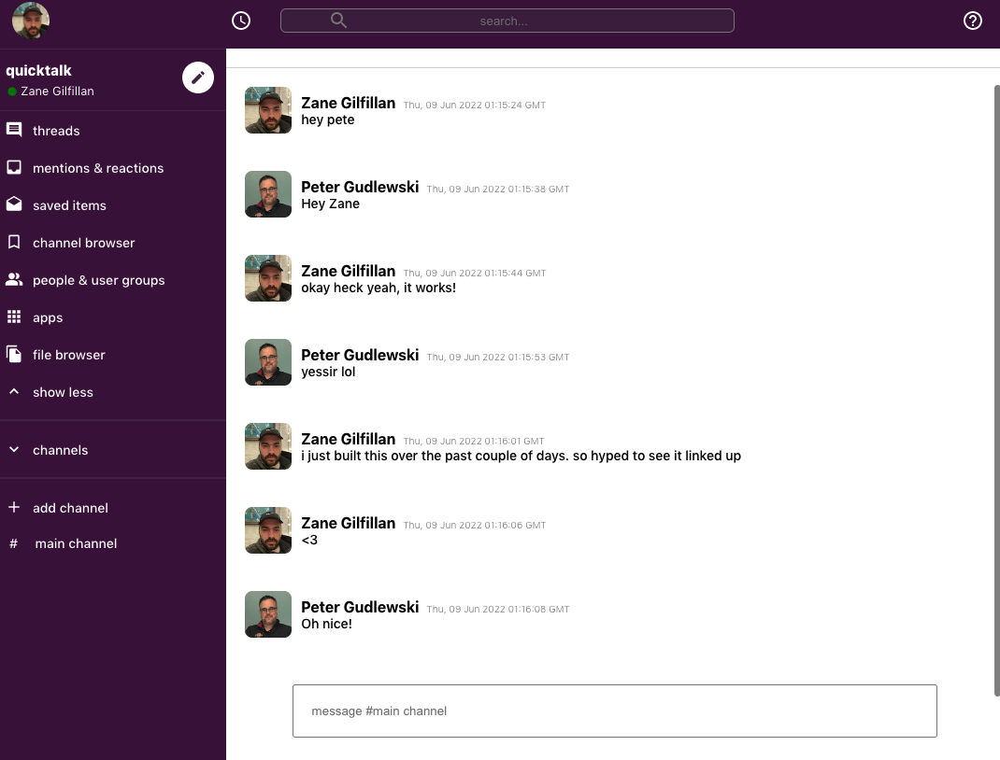
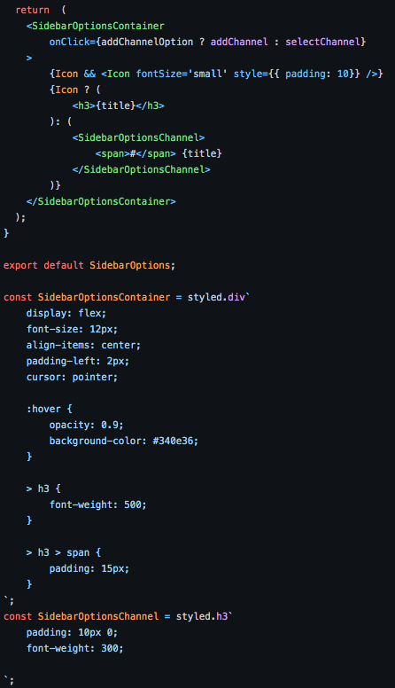

# QuickTalk

**using react, firebase, & styled components to build a minimal and effecient chat app**



# About

This project started with an issue that I ran into on Discord/Slack. When starting a 'thread' in a channel, you are not able to then move the thread into a different channel. I've been exploring different options with building chat applications and this is the first iteration.

# Features
**styled components**
<br/>
this was my first venture into styled components and it really helps clean up the code and feels super quick to code. I'll continue using them in the future. I'll leave an snippet below to show how clean and readable it is:



**google authentication**
when working with firebase it is extremely straightforwared when using built in auth options:

```
    const firebaseApp = firebase.initializeApp(firebaseConfig);
    const db = firebaseApp.firestore();
    const auth = firebase.auth();
    const provider = new firebase.auth.GoogleAuthProvider();

export { auth, provider, db};
```

then in our App.js we can add:

```
    const [user, loading] = useAuthState(auth);
```

simple as that!

# Issues
the largest problem that I ran into was with passing states with redux through firebase. the main errors were as follows:<br/>
*useDispatch() Error: Could not find react-redux context value; please ensure the component is wrapped in a 'Provider'*

after some hardcore googling I came to this conclusion:<br>

My use of ```this.setState()``` was class based and ```useDispatch()``` can't be used in this way. I then had to use ```connect()``` instead and have the ```dispatch``` injected into my ```this.props```

by tweaking my store.js file I was able to safely wrap my application in the ```<Provider>``` tag:

```
import React from 'react';
import ReactDOM from 'react-dom/client';
import './index.css';
import App from './App';
import reportWebVitals from './reportWebVitals';
import { Provider } from 'react-redux';
import store from './app/store'


const root = ReactDOM.createRoot(document.getElementById('root'));
root.render(
  <React.StrictMode>
    <Provider store={store}>
      <App />
    </Provider>
    
  </React.StrictMode>
);
reportWebVitals();
```

# Work In Progress

This is just the first step into my chat application journey. The next steps are going to be working on a 'thread' feature.

# Live Application

You can drop by and say hello at https://quicktalk-9c297.web.app/

have a nice day ❤️